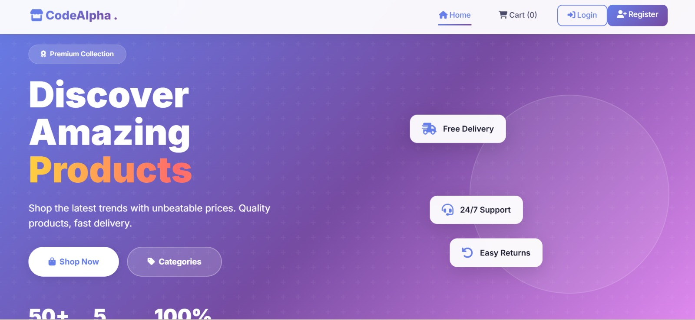
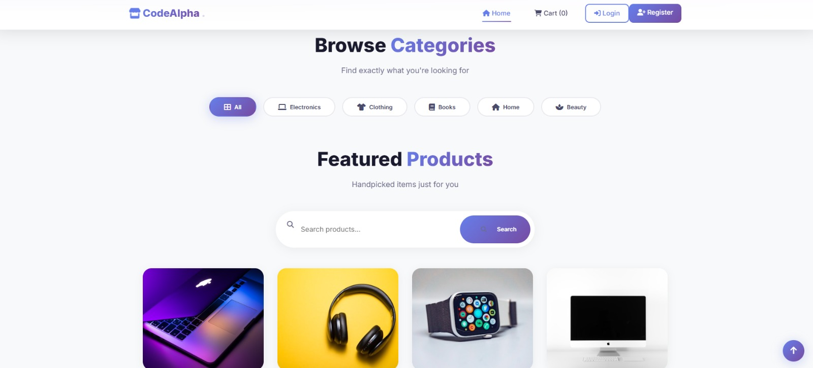
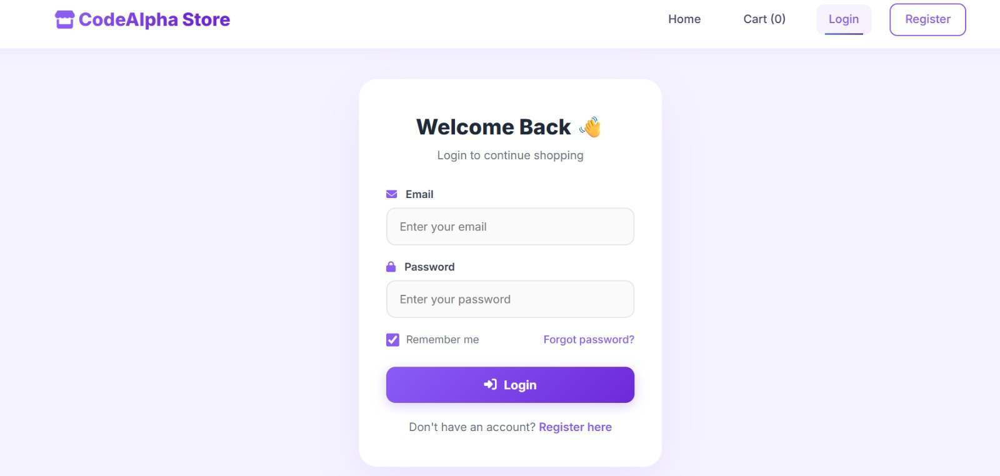
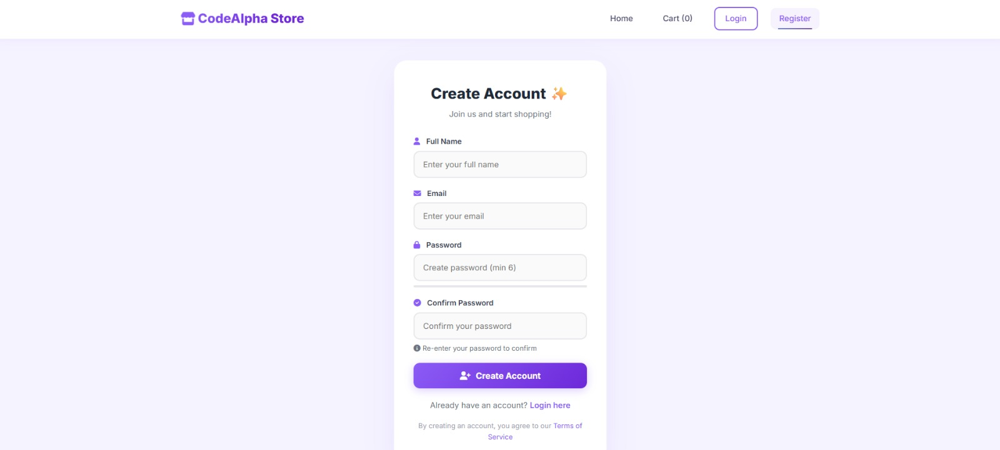
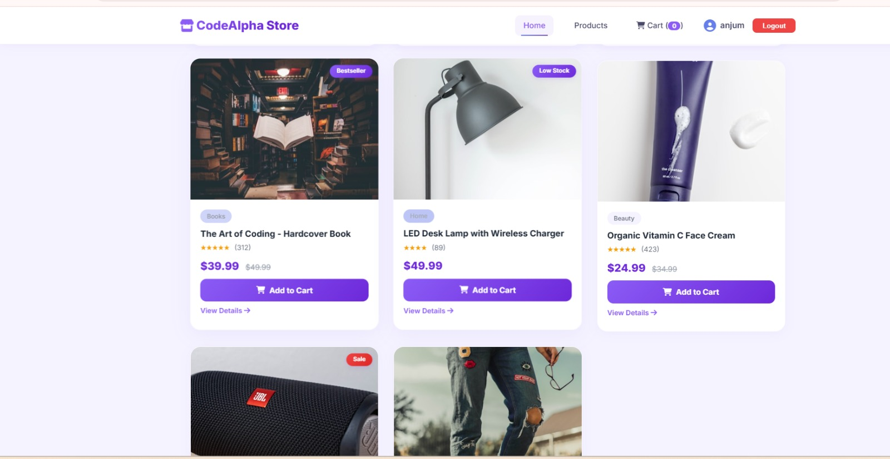
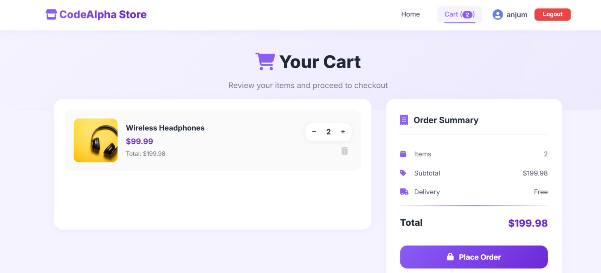
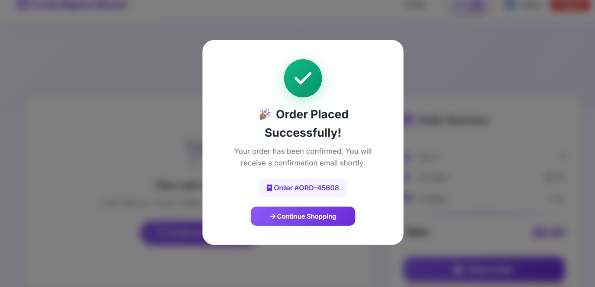

# 🛒 CodeAlpha E-Commerce Store

A full-stack E-Commerce web application developed as part of the **CodeAlpha Full Stack Development Internship**. This project allows users to browse products, register and log in securely, manage their shopping cart, and place orders through a clean and responsive user interface.

---

# 📌 Project Overview

The **CodeAlpha E-Commerce Store** is designed to simulate a real-world online shopping platform. It provides secure authentication, product browsing, cart management, and order placement using **Node.js, Express.js, MongoDB, HTML, CSS, and JavaScript**.

---

# ✨ Features

- 🔐 Secure User Registration & Login
- 👤 User Authentication using JWT
- 🛍️ Browse Products
- 🔎 Search & Filter Products
- 🛒 Shopping Cart Management
- 📦 Place Orders
- 👤 User Profile
- 📱 Responsive Design
- ⚡ Fast & Simple User Interface

---

# 🛠️ Tech Stack

### Backend
- Node.js
- Express.js
- MongoDB
- Mongoose
- JWT Authentication
- Bcrypt.js

### Frontend
- HTML5
- CSS3
- JavaScript (ES6)

---

# 📁 Project Structure

```text
CodeAlpha_EcommerceStore/
│
├── backend/
│   ├── config/
│   ├── controllers/
│   ├── middleware/
│   ├── models/
│   ├── routes/
│   └── server.js
│
├── frontend/
│   ├── pages/
│   ├── scripts/
│   ├── styles/
│   └── images/
│
├── screenshots/
│   ├── landing.jpeg
│   ├── index.jpeg
│   ├── login.jpeg
│   ├── register.jpeg
│   ├── home.jpeg
│   ├── cart.jpeg
│   └── order.jpeg
│
└── README.md
```

---

# 🚀 Installation

## Clone Repository

```bash
git clone https://github.com/nikhad28/CodeAlpha_EcommerceStore.git

cd CodeAlpha_EcommerceStore
```

---

## Install Dependencies

```bash
cd backend

npm install
```

---

## Configure Environment Variables

Create a **.env** file inside the backend folder.

```env
PORT=5000

MONGO_URI=your_mongodb_connection_string

JWT_SECRET=your_secret_key
```

---

## Run the Backend

```bash
npm start
```

or

```bash
npm run dev
```

---

## Open the Application

```
http://localhost:5000
```

---

# 📸 Screenshots

## 🌐 Landing Page



---

## 🏠 Index Page



---

## 🔐 Login Page



---

## 📝 Register Page



---

## 🛍️ Home Page



---

## 🛒 Shopping Cart



---

## 📦 Order Page



---

# 🔄 Workflow

```text
Landing Page
      │
      ▼
Register / Login
      │
      ▼
Browse Products
      │
      ▼
View Product Details
      │
      ▼
Add to Cart
      │
      ▼
Update Cart
      │
      ▼
Place Order
```

---

# 🔒 Security Features

- JWT Authentication
- Password Encryption using Bcrypt
- Protected Routes
- User Session Management
- Secure API Requests

---

# 🎯 Future Enhancements

- ❤️ Wishlist
- 💳 Online Payment Gateway
- ⭐ Product Reviews & Ratings
- 📊 Admin Dashboard
- 📦 Inventory Management
- 🚚 Order Tracking
- 📧 Email Notifications

---

# 📚 Learning Outcomes

- Full Stack Web Development
- REST API Development
- MongoDB Database Operations
- JWT Authentication
- Express.js Routing
- CRUD Operations
- Responsive UI Design
- Git & GitHub

---

# 👨‍💻 Internship

**CodeAlpha – Full Stack Development Internship**

---

# 👩‍💻 Developer

**Nikhad Shaikh**

🔗 **LinkedIn:**  
https://www.linkedin.com/in/nikhad-shaikh-5a2b71394/

💻 **GitHub:**  
https://github.com/nikhad28

---

## ⭐ Support

If you found this project useful, don't forget to **Star ⭐ this repository**.